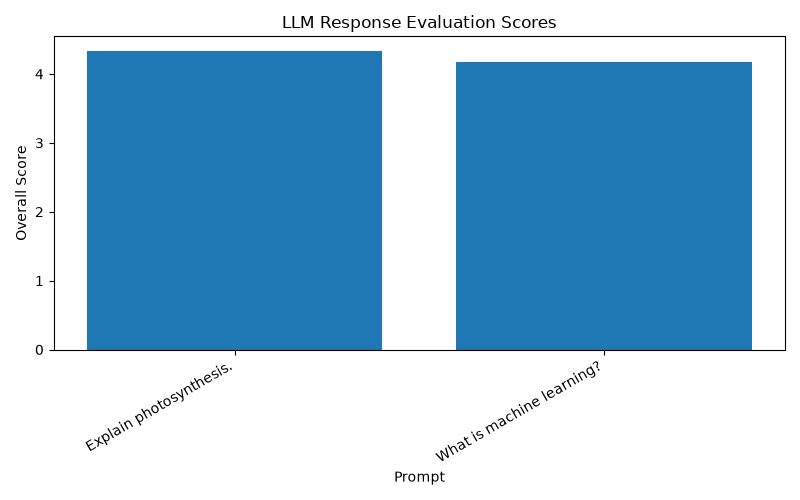

# LLM Response Evaluation Toolkit


A Python toolkit for evaluating Large Language Model (LLM) responses using structured quality metrics, automated scoring, and reproducible evaluation workflows.

This project demonstrates practical skills in **LLM evaluation, prompt engineering, response quality assessment, human feedback workflows, and AI model benchmarking.**

---

# Project Overview

Evaluating LLM outputs consistently is an essential part of building reliable AI systems. This project simulates an AI evaluation pipeline by scoring model responses across multiple quality dimensions and generating structured evaluation reports.

The toolkit measures:

- Instruction Following
- Accuracy
- Reasoning Quality
- Clarity
- Completeness
- Safety
- Overall Response Quality

The goal is to provide an explainable and repeatable framework for assessing AI-generated responses.

---

# Features

- Automated LLM response evaluation
- Multi-dimensional quality scoring
- JSON-based evaluation reports
- Modular Python architecture
- Visualization dashboard
- Automated testing with pytest
- Extensible scoring framework
- GitHub version control

---

# Evaluation Workflow

```text
Prompt + Model Response
          |
          ↓
Response Processing
          |
          ↓
Quality Evaluation
          |
          ↓
Dimension Scoring
          |
          ↓
Overall Quality Score
          |
          ↓
JSON Evaluation Report
          |
          ↓
Visualization Dashboard
```

---

# Example Output

```json
{
    "instruction_following": 5,
    "accuracy": 4,
    "reasoning": 5,
    "clarity": 5,
    "completeness": 4,
    "safety": 5,
    "overall_score": 4.67
}
```

---

# Dashboard Preview



---

# Repository Structure

```text
llm-response-evaluation/

├── data/
│   ├── sample_responses.json
│   └── evaluation_results.json
│
├── docs/
├── examples/
├── notebooks/
│
├── src/
│   ├── evaluator.py
│   ├── scoring.py
│   ├── utils.py
│   └── __init__.py
│
├── tests/
│   └── test_scoring.py
│
├── visualizations/
│   ├── dashboard.py
│   └── score_distribution.png
│
├── README.md
├── requirements.txt
├── .gitignore
└── LICENSE
```

---

# Technologies

- Python
- Pytest
- Matplotlib
- JSON Processing
- Prompt Engineering
- LLM Evaluation
- AI Quality Assessment

---

# Running the Project

## Evaluate Responses

```bash
python src/evaluator.py
```

## Generate Dashboard

```bash
python visualizations/dashboard.py
```

## Run Tests

```bash
python -m pytest
```

---

# Testing

The project includes automated tests for the scoring framework.

Current coverage includes:

- Response scoring logic
- Overall quality calculations
- Evaluation workflow validation

All tests can be executed using pytest.

---

# Future Improvements

Planned enhancements include:

- Pairwise response comparison
- Rubric-based evaluation
- LLM-as-a-Judge workflows
- Human preference datasets
- Confidence scoring
- Web-based evaluation dashboard

---

# Author

**Kevin Njogu**

AI Trainer | LLM Evaluator | Machine Learning Enthusiast